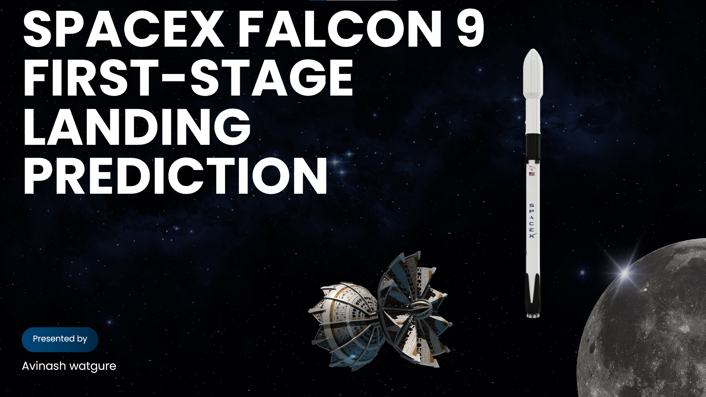

# SpaceX-Falcon-9-First-Stage-Landing-Prediction

This report explores the potential to predict the landing success of Spacex Falcon 9 first stages using data-driven techniques. With Spacex’s reusable launch systems reducing costs significantly, accurate predictions of landing outcomes can enhance planning and offer cost competitiveness in the aerospace sector. 

# Project Summary

• Developed a machine learning model to predict the successful landing of Spacex Falcon 9’s first stage, potentially saving $ 100 M+ per launch via booster reuse.  
• Collected and processed launch data via SpaceX API, compiling 90+ records with features including booster version, payload mass, orbit type, and landing outcomes.  
• Performed data cleaning and feature engineering using pandas, NumPy, and API integration, enhancing dataset quality and usability.  
• Applied Logistic Regression, Decision Tree, SVM, and KNN classifiers, achieving a top model accuracy of ~90%.  
• Delivered insights through exploratory data analysis (EDA) and visualisations, aiding in understanding launch success factors.
